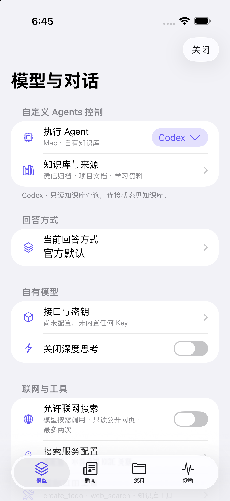
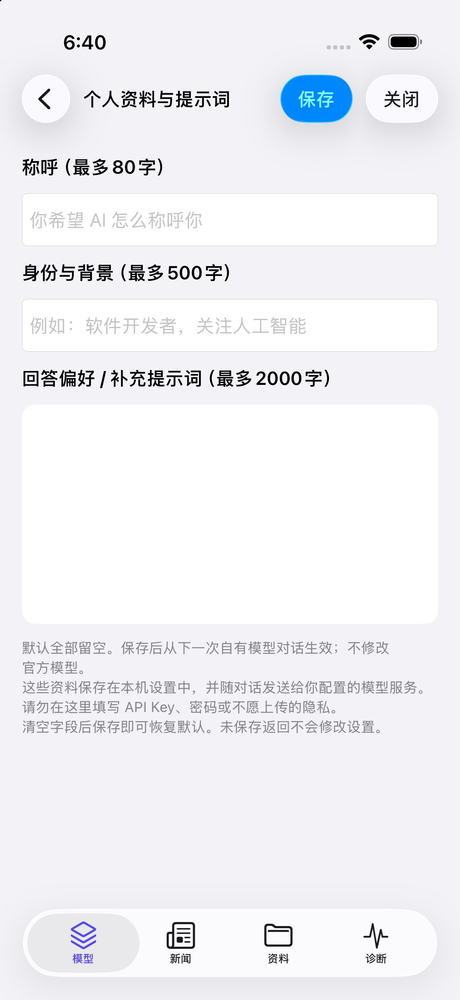
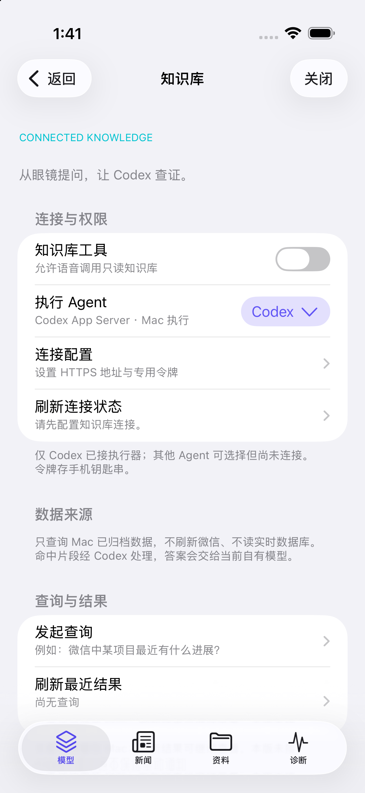

# Turbo IO V2 · 雷鸟 iO 官方 App 扩展研究版

**仅公开我们编写的扩展源码与本地工具；禁止未经授权的商业使用。** 本目录按仓库 [PolyForm Noncommercial 1.0.0](../LICENSE) 提供，不是允许商用的 MIT 项目。第三方权利和许可不因本项目发生变化。

这不是雷鸟官方发布，也不是给小白的下载即用 App。V1 是独立 SDK + 示例客户端；**V2 在使用者自行准备的兼容官方 App 副本中加入 TurboIO 研究界面**，复用其已有 ASR、连接和业务流程。两条路线并存，不能把 V1 的实测结论直接用于 V2。

不提供合并后的修改版 IPA、个人预签名安装包、账号或密钥。仓库首页单独列出原厂 iOS 1.0.5（201）砸壳 IPA 的 Release 输入，版权仍归原权利人；它不是合并后的 Turbo IO。只读源码/跑 UI 预览不需要这些文件；实际合并需要有权使用且符合技术条件的应用副本。本工具不下载、不解密、不移除登录或付费限制。**普通 App Store 加密 IPA 不能直接拿来合并。**

## 可选高风险固件研究构建

**微信读书 TWR1：** [原创 AP、书架/本地阅读手机模块、固件与构建说明](../firmware-research/strix-1.0.4.12/native-navigation/weread/README.md) · [架构与参考项目](../docs/WEREAD_RESEARCH.md)。不含网页正文适配或 Cookie；公开手机模块尚未接入本页默认构建与 TWR1 打包门禁。长按旋钮返回可能异常；没有匹配手机集成请先别刷，不要使用下面的音乐/导航授权代替阅读固件。

**新增 [TMU1 网易云音乐与眼镜五行歌词教程](../firmware-research/strix-1.0.4.12/native-navigation/music/README.md)**：官方 iOS1.0.5（201）宿主，`TIO_MUSIC=1` 显式编译，配对 TMU1 精确固件。手机/镜片封面、歌词、播放控制获实测正常反馈；**旋钮太灵敏、易误切歌为已知问题**。扫码登录未通过，不绕过服务限制。源码与固件公开，不提供合并/签名后的 IPA。非开发者请勿刷。

另提供 [Strix OS 1.0.4.12 R3 实验的源码、手机接入与构建说明](../firmware-research/strix-1.0.4.12/docs/BUILD.md)。**试验用品，非开发者勿刷，不保证回滚或救砖。** 普通构建默认不编译该模块；只有显式 `TIO_OTA_RESEARCH_ENABLED=1` 且打包指定 `--experimental-ota R3` 才接入。下载和发起传输仍需手机上分别人工确认，不自动刷写。公开集成版与私用前身的验收分开记录。

## V2 增加了什么

**iOS 必须准备合法兼容的未加密应用副本；可核对首页明确列出的原厂 IPA 输入或自行准备，不提供代砸壳服务。** 商店安装不等于取得可合并的未加密 Runner.app。准备好兼容副本后，可将本仓库和[首页提示词](../README.md#让-claude-code--codex-帮你接入)交给 Claude Code / Codex，按[分平台接入说明](../docs/AI_SETUP.md)检查和构建；缺少输入时先做预览，不跳过门槛。首页 Android 官方下载页不能替代 iOS 输入。

### 最新适配：官方 1.0.5（201）+ Strix OS 1.0.4.12

新增精确版本 / Build / Runner UUID 校验，保留 1.0.4（195）和 1.0.2（67）。非越狱 iPhone Air 私用研究版安装与扩展加载已确认；用户完成 **Strix OS 1.0.4.12** 升级后反馈「一切正常」，当前未报告兼容问题。此处记录原厂1.0.5适配，不包含固件改动；后续TNV1实验固件另行发布（见文末），该反馈不等于逐项全量回归或所有机型均已验证。详见[1.0.5 适配与升级说明](docs/COMPATIBILITY_105.md)。

### 历史适配：官方 1.0.4（195）+ Strix OS 1.0.4.8

保留旧版 1.0.2（67），新增精确版本 / Build / Runner UUID 校验；不放宽未知包限制。非越狱 iPhone Air 的个人签名研究版已获得升级后语音、自有模型与导航正常的用户反馈。新版底栏识别“回忆、探索”，第五项 TurboIO 使用深浅色毛玻璃。详见[版本适配与验收说明](docs/COMPATIBILITY_104.md)。

### 本次重点：眼镜导航

**搜索目的地 / 单击地图选点 → 选择步行、骑行或驾车并规划路线 → 开始模拟 → 眼镜持续文字指引。** 地图右侧有真实缩放按钮，模拟起点独立保存，不再因选终点而跟着移动；支持停止眼镜显示但保留手机导航。入口在 **TurboIO → 资料 → 步行 / 骑行 / 驾车导航**。

当前常亮字幕仅开放模拟验收，4分钟保护；实际户外和后台不作为已完成能力。官方1.0.2(67) + StrixOS1.0.3.15的私用前身已确认免重复预览显示；历史官方1.0.4(195) + StrixOS1.0.4.8的升级后导航也收到正常反馈；当前实测为官方1.0.5（201）+ StrixOS1.0.4.12，TNV1专用版本另见文末，不能外推全部模式及固件。完整构建及使用流程见 **[导航教程](docs/NAVIGATION.md)**。

| 功能 | 实现和边界 |
| --- | --- |
| TurboIO 底部入口 | 原生导航适配层加入第五项；原四项仍转交官方。匹配不明确、辅助功能等情况下回退，不篡改 Flutter 的业务 Tab 枚举 |
| 自定义文字模型 | 官方 ASR 后，把已识别问题交给用户配置的 HTTPS OpenAI-compatible chat/completions；支持流式文字和最近50条成功消息的进程内上下文 |
| 回答同步朗读（TTS） | 官方回答与自有模型回答均可边显示边朗读；默认 iOS 本机语音，不需要 TTS Key。可选阿里云流式 TTS，需在 App 内填写自己的 WSS 地址与 Key；语音走眼镜音频路由，连接或路由异常时不承诺出声 |
| 个人资料与提示词 | 程序内编辑称呼、身份、回答偏好；默认全空，保存后供下一次自有模型对话使用 |
| 会话收尾 | 响应完成与官方页面等待事件配合的退出保护；支持“退下吧 / 关闭 / 没事了 / 关闭窗口”等完整短句，仍需目标设备验收 |
| 联网和自然语音待办 | TinyFish 搜索、模型 `create_todo` 工具；写操作与搜索/知识库混用有保护。通用服务兼容性取决于模型是否支持相应 Tools |
| AI 新闻提词器 | 默认 AI 主题，TinyFish + 自有模型生成带来源长稿，传到内置提词器匀速阅读；不是实时字幕，不是任意镜片 UI |
| 录音与文字 | 已存在本机音频复制导出、系统分享；导入/粘贴官方转写后用自有模型整理为 Markdown，不替换官方 ASR |
| 全天智记导出研究 | 显式开启后另存最终文字/音频；只覆盖实际接收到的内容，不能补回此前未保存的历史音频，不保证官方历史全文自动读取 |
| Agents / 知识库 | Codex 只读检索参考服务和手机 Tools；Claude Code、Hermes、WorkBuddy、OpenClaw 可选但未实现执行器，不伪装已连接 |

**未实现/未完整验收：** 日常扩展中的任意眼镜 UI、像素截图、完整官方历史导出、新闻重启免校准、所有固件兼容、知识库手机→Mac→镜片闭环、APNs 主动推送、网页待办全链路双向同步。云端 TTS 在私用 iPhone Air 上已获得官方与自有回答各完整朗读一次的镜片/听感反馈；默认本机 TTS 已编译与安装，仍待独立眼镜听感验收，不把云端结果算作本机结果。固件修改另见独立的高风险研究页，不是日常扩展能力。

## 界面

以下是无账号、无密钥、无眼镜的实际 UIKit 模拟器页面，不是已连接眼镜或知识库的证明。

<p>
  
  
  
</p>

## 构建与零密钥预览

准备 macOS、完整 Xcode（选择正确 Developer 路径并完成首次启动）、Node.js 22.16+、Python 3。默认扩展与零密钥预览只使用系统框架和源码；**可选真实地图导航构建另需固定版本的高德SDK**，获取、资源合并与Key配置见[导航教程](docs/NAVIGATION.md)。默认构建不含高德在线地图，不能只填Key就补齐未链接的SDK。

从仓库根目录运行：

```sh
bash official-addon/test.sh
node --test official-addon/macho-embed.test.mjs official-addon/package.test.mjs official-addon/knowledge-bridge/turbo-knowledge.test.mjs
bash official-addon/build.sh embedded
bash official-addon/preview/build.sh
```

动态库输出：`official-addon/build/embedded/TurboIOPrivateAddon.dylib`。它不是可直接安装的 App。默认使用本研究中实测过的传统链接修正格式；可用 `TIO_CLASSIC_BINDINGS=0` 做对照，不能因此跳过真机验收。

先在 Xcode 启动一个 iPhone 模拟器，再运行：

```sh
xcrun simctl install booted official-addon/build/research-preview/ResearchPreview.app
xcrun simctl launch booted io.turboio.research.preview
```

可追加 `--profile` 或 `--knowledge` 直接预览对应页。预览不包含官方连接能力，不应填真实 Key，不会以演示数据冒充真实镜片效果。

## 本地合并、签名、安装

### 1. 兼容性门槛

**本目录适配对象：iOS「雷鸟 AI 眼镜」1.0.5（Build 201）、1.0.4（Build 195）、1.0.2（Build 67）。其他iOS官方版本尚未适配；Android使用独立的 [android-addon](../android-addon/README.md)，不能套用此工具。** 这里的版本指官方 App，不是眼镜固件，也不是 Turbo IO V2 的版本号。

- Bundle ID 为 `com.rayneo.venus.pub`；`1.0.5 / 201` 对应 Runner UUID `748fd301da603095a2449bd0558faca5`，`1.0.4 / 195` 对应 `261c8e78f9553d7d85f713b9082972cf`，`1.0.2 / 67` 对应 `eeea85e54114313cb65173c90a6b5d3c`。
- 合并前核对源 App 的 `Info.plist` 中版本 / Build 组合。相同版本号仍需匹配对应 UUID；其他官方版本需要重新适配，不要修改版本号或跳过检查强行合并。
- 输入为合法可用、未加密、thin arm64 的 `Runner.app`，可以是用户自行准备的 IPA 中的 `Payload/Runner.app`。工具不处理加密绕过；遇到加密镜像、未知版本、已嵌入扩展、不足的头部空间、未审查的应用扩展/多架构镜像/符号链接会拒绝。
- UUID 用于版本/ABI 适配，不是完整来源安全鉴定；仅使用自己信任的应用源。
- 需要自己的有效开发签名证书、匹配 Bundle ID 和设备的描述文件、已信任电脑且允许开发运行的 iPhone。
- 原始应用备份、账号恢复、签名到期与配对切换由使用者负责。不要先删掉唯一可用的官方 App。

### 2. 只在本机生成自己的包

下面全是占位参数，不包含维护者的证书或设备 ID。输入 `.app` 不被修改，输出必须是不存在的新目录；失败产物保留在输出目录供用户自行检查。

```sh
node official-addon/package.mjs \
  --app /absolute/authorized/Payload/Runner.app \
  --addon /absolute/Turbo-IO/official-addon/build/embedded/TurboIOPrivateAddon.dylib \
  --profile /absolute/private/development.mobileprovision \
  --identity YOUR_CERTIFICATE_SHA1 \
  --device YOUR_DEVICE_ID \
  --out /absolute/private/new-output
```

工具执行预检查、嵌入、嵌套代码重签、主程序重签、签名与归档校验。只在用户本机生成 `Payload/Runner.app` 和 `TurboIO-local-only.ipa`；不会上传。默认不带任何模型/搜索配置，并拒绝携带私用 bootstrap 的输入副本。

保持官方 Bundle ID 不等于继承官方推送、钥匙串、App Groups 或 Apple 登录权限。工具只使用自己的描述文件已有权限，不伪造厂商 entitlement。

如果源包经过商店设备裁剪，新增机型不一定具备全部资源。`--product iPhone18,4` 等显式参数仅用于已知设备研究副本的机型列表对照，不修复缺失资源、不保证兼容。不要对不支持的版本去掉检查硬装。

使用自己的设备标识安装：

```sh
xcrun devicectl device install app --device YOUR_DEVICE_ID /absolute/private/new-output/Payload/Runner.app
```

输出“安装成功”只代表系统接受安装，仍需实际打开、登录、连接眼镜并逐项验证。不能通过签名回执推断镜片工作正常。

### 3. 在程序中配置

1. 打开改包后的雷鸟 App，进入底部 **TurboIO → 模型**。未出现第五项时先看诊断/回退，不反复解绑。
2. **自有模型 → 接口与密钥**：填写完整 HTTPS `.../chat/completions` 地址、模型 ID 和自己的 API Key。Key 存钥匙串，不回显。
3. 在 **个人资料与提示词** 填自己的称呼、背景、回答偏好。资料默认留空，存在本机设置，不存于 IPA；对话时会发给自有模型，请勿填密码。
4. 先做诊断中的合成模型测试，确认真实官方对话模板后再选择自定义模型。首次使用可能需要先完成一次官方问答；模板未知时不接管。
5. 搜索需要自己的 TinyFish Key，新闻需要模型和搜索均可用。提词配置按设备/App版本保存；首次从旧版迁移可能仍需用公开测试稿学习一次各模式，未知格式不擅自保存。导航的高德Key是另一项独立配置，不是TinyFish Key。
6. 知识库是可选项；需自行运行 [参考服务](knowledge-bridge/README.md)、配置受保护的 HTTPS 地址和独立令牌。它不是维护者免费提供的云服务。
7. **回答同步朗读**：在「TurboIO → 模型与对话」开启朗读；新安装默认使用 **本机语音（免 Key）**。先点「播放测试语音」确认眼镜音频路由，再分别测试官方回答和自有模型回答。可选「阿里云流式」仅当你自行配置有效 `wss://.../api-ws/v1/inference` 地址和 TTS Key 后使用；密钥存本机钥匙串，不写入源码或 IPA。不同手机音频路由、熄屏和打断情形仍需自己实机验收。

切换 **V1 独立 App** 时务必先在当前官方 App 解绑，再到系统蓝牙“忽略此设备”，重新进入配对模式；V1 与官方/改包官方不能抢同一副眼镜。V2 是同一官方 App 副本内的扩展，不需要为了打开 TurboIO 页再运行另一个配对客户端。

## 实现思路

```text
眼镜 → 官方连接 / ASR → 已验证的聊天回调
                            ↓
                 TurboIO → 自有模型流式回答
                            ├─ TinyFish 搜索
                            ├─ 受约束的待办工具
                            └─ HTTPS 知识库 → Mac Codex / 本地归档
                            ↓
                    官方回包模板 → 眼镜内置 UI
                            └─ 可选 TTS → 眼镜音频路由
```

`Addon.m` 做版本/运行时签名检查和会话协调；`Core.m` 管理流解析、历史与退出状态；`VoiceTTS*` 用 AVFAudio 实现免 Key 本机朗读及可选 WebSocket 流式朗读；`WebSearch.m` 处理模型 Tools；`NewsTeleprompter.m` 做收稿/开始/位置回报；`Recording*`、`AlwaysOn*` 提供有范围限制的独立导出；`HomeTabBridge.m` 负责第五项适配和回退。`Profile*` 是公开版本新增的用户可编辑资料，不含维护者身份。

保留官方 ASR **不等于语音离线**，音频仍可能经过官方服务；自有模型收到识别文字及有限历史，搜索收到检索词。导出功能不自动把录音上传自有模型，整理需用户确认。录音应取得相关人员同意。

## 验收、问题反馈与贡献

看 [V2 验证表](docs/VALIDATION.md) 和 [安全/发布说明](docs/SECURITY.md)。提交问题请给出应用版本、系统版本、复现步骤和脱敏错误码，不要上传 IPA、崩溃日志全集、Key、会话正文、录音、签名材料或设备标识。

本目录是非商业研究源码，提供代码不代表为第三方应用再分发、服务访问或商业利用授予许可。具体使用范围以根 LICENSE、第三方许可和适用规则为准；不承诺规避厂商条款后的使用合法性。

## TNV1 原生导航固件配套（高风险可选构建）

Strix OS 1.0.4.12 的新独立导航应用与 Turbo Display **测试工具**已有匹配研究发布。仅适配官方 iOS 1.0.5（201），使用自己的高德 Key 与签名；普通构建不默认启用试刷。完整固件、AP-only 校验、重建、手机合并及操作步骤见 [TNV1 发布说明](../firmware-research/strix-1.0.4.12/native-navigation/README.md)。旧 R3 不是这个版本，不要混刷；仅 AP 改动仍可能变砖，回滚无保证。
